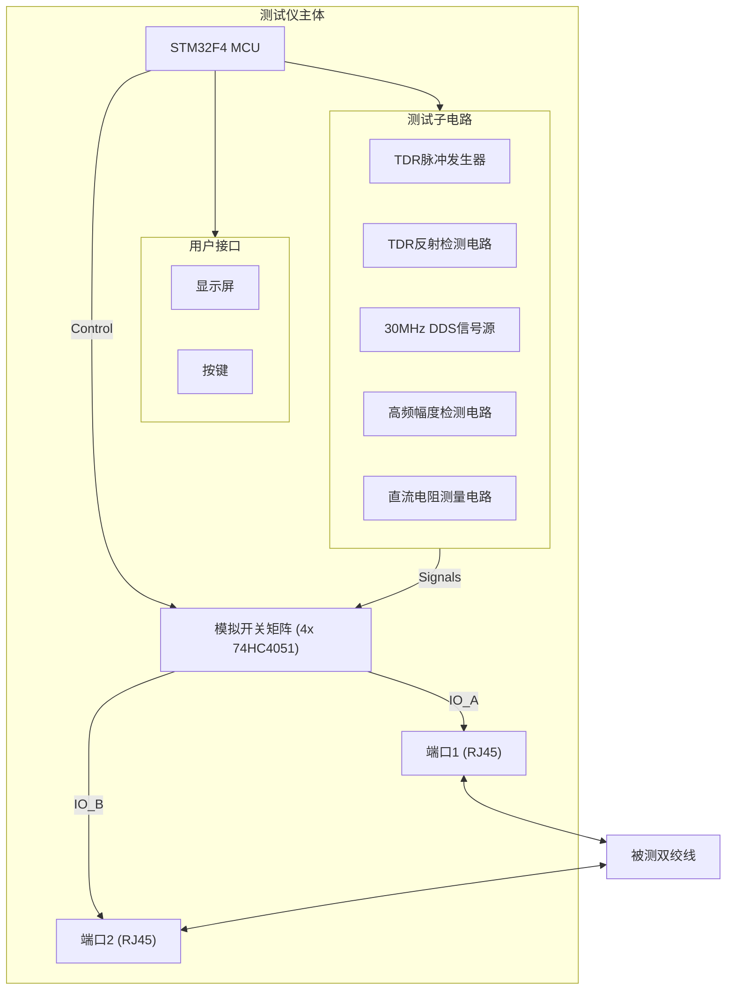
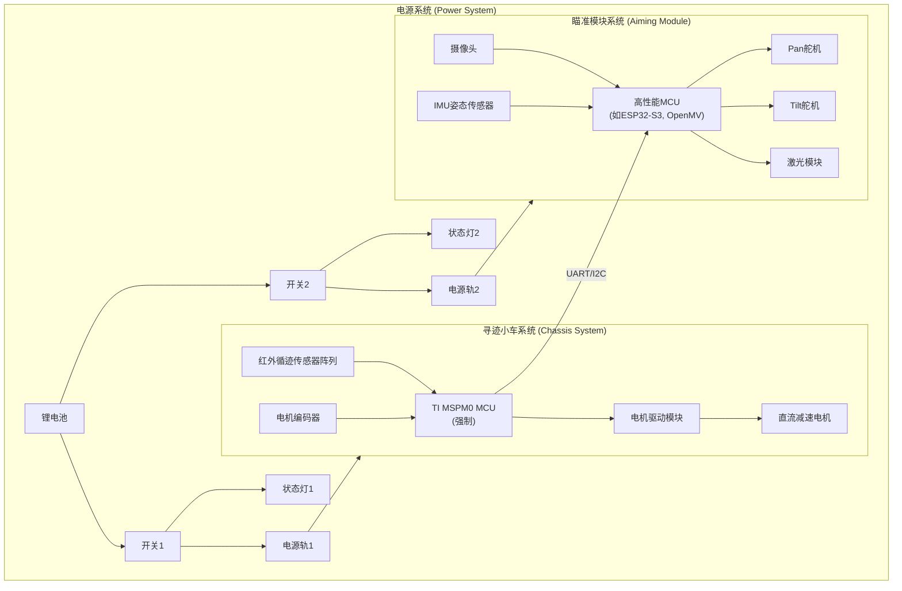
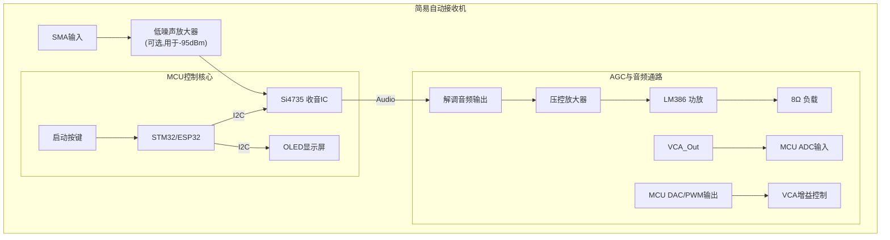

# **2025年全国大学生电子设计竞赛赛题综合分析**

### **(D题、E题、F题)**

## **D题：简易以太网双绞线测试仪**

### **一、 解题要求分析**

本题目要求设计一个能够对以太网双绞线进行多维度参数测量的便携式测试仪。测试仪需具备两种核心工作模式：“双端检测”和“单端检测”，并使用不高于6V的单电源供电。核心挑战在于高频信号处理、微小电气参数的精确测量以及时域反射技术（TDR）的应用。

#### **1\. 核心功能与约束**

* **双工作模式**: 需通过按键在“双端检测”和“单端检测”模式间切换。  
* **电源限制**: 采用不大于6V的单电源供电。这要求在电路设计中必须考虑高效的电源管理和电平转换。  
* **非电测限制**: 明确禁止使用称重、超声、激光等非电参数方法测量线缆参数。所有测量必须基于电学原理。  
* **校准**: 现场会提供1米SFTP和50米UTP标准线缆用于赛前校准，这暗示了仪器的测量算法需要有校准功能以提高准确性。  
* **操作**: 测试时为一键启动，不允许额外调整。

#### **2\. 任务分解 (基本要求 \- 50分)**

* **(1) 模式切换 (4分)**: 实现UI和模式切换逻辑，是软件框架的基础。  
* **(2) 双端检测 (30分)**: 线缆两端都接入仪器。  
  * **线对连接关系**: 判断是直连线还是交叉线。这本质上是一个8x8的通断关系矩阵测试。  
  * **类型 (UTP/SFTP)**: 判断是非屏蔽双绞线还是双屏蔽双绞线。关键在于检测SFTP线缆RJ45接头的金属屏蔽层是否导通。  
  * **直流电阻**: 测量1m\~50m线缆的电阻，相对误差|δ| ≤ 10%。由于线缆电阻值很小（通常为mΩ/m级别），需要精确的微电阻测量电路，如四线制（开尔文）测量法。  
  * **时间**: 测量时间 ≤ 5s。  
* **(3) 单端检测 (16分)**: 线缆仅一端接入仪器。  
  * **线缆长度**: 测量10m\~50m线缆的长度，|δ| ≤ 5%。  
  * **线对间短路**: 检测任意两个线芯之间是否存在短路。  
  * **时间**: 测量和检测时间均 ≤ 5s。

#### **3\. 任务分解 (发挥部分 \- 50分)**

* **(1) 交流衰减测量 (10分)**:  
  * **模式**: “双端检测”模式。  
  * **指标**: 测量线缆在**30MHz**频率下的交流衰减dB值，范围10m\~50m，|δ| ≤ 10%，时间 ≤ 5s。  
  * **关键点**: 需要生成30MHz的正弦波激励信号，并精确测量线缆输入端电压Uipp和输出端电压Uopp，同时要考虑**阻抗匹配**问题（通常为100Ω）。  
* **(2) 高精度长度测量 (15分)**:  
  * **模式**: “单端检测”模式。  
  * **指标**: 测量1m\~50m线缆长度，|δ| ≤ 1%。这要求TDR系统有极高的时间分辨率和稳定性。  
* **(3) 短路位置测量 (20分)**:  
  * **模式**: “单端检测”模式。  
  * **指标**: 测量1m\~50m线缆的短路点位置，|δ| ≤ 1%，时间 ≤ 5s。这是本题的核心难点，同样基于TDR原理，但需要能识别出短路点（低阻抗）和开路点（高阻抗）反射信号的差异。

#### **4\. 核心技术原理**

* **通断、类型、短路检测**: 通过MCU控制的GPIO扫描和ADC测电阻实现。  
* **直流电阻测量**: 四线制测量法，以消除接触电阻和引线电阻的影响。  
* 长度与短路点定位: 时域反射技术 (Time Domain Reflectometry, TDR)。基本原理是向线缆注入一个快速上升沿的脉冲，脉冲沿线缆传播，当遇到阻抗不连续点（如线缆末端、短路点）时，会产生一个反射脉冲。通过精确测量从发射到接收到反射脉冲的时间 Δt，可以计算出故障点或线缆末端的距离 L。  
  L=2c⋅Vp​⋅Δt​

  其中 c 为光速，Vp 为信号在电缆中的传播速度（相对于光速的百分比，需要校准），Δt 为往返时间。  
* **交流衰减**: 信号发生与高频电压测量。

### **二、 核心元器件选购清单**

| 类别 | 器件名称 | 型号/规格建议 | 数量 | 用途与说明 |
| :---- | :---- | :---- | :---- | :---- |
| **主控单元** | **MCU** | STM32F4系列, ESP32-S3 | 1 | 需要高性能、高速ADC、多路GPIO、高速定时器（用于TDR时间测量）。 |
| **信号生成** | **DDS信号源** | AD9850 / AD9851 | 1 | 用于生成发挥部分所需的30MHz正弦波激励信号。 |
|  | **脉冲发生器** | 高速逻辑门 (如 74LVC1G04) | 1 | 生成TDR所需的快速上升沿脉冲。 |
| **信号调理与测量** | **高速运放** | AD8065, THS4031 | 2+ | 用于信号缓冲、放大，特别是在30MHz频段。 |
|  | **高频检波器** | AD8307, AD8361 | 1-2 | （推荐方案）用于测量30MHz信号的幅度（dBm值），将高频交流信号转换为易于测量的直流电压。 |
|  | **高速比较器** | TLV3501, ADCMP600 | 1 | 用于TDR系统中检测微弱的反射脉冲。 |
|  | **精密ADC** | AD7705, 或MCU自带的高精度ADC | 1 | 用于精确测量直流电阻中的微弱电压信号。 |
|  | **精密恒流源** | REF200, 或由运放和基准电压源搭建 | 1 | 为四线制电阻测量提供稳定的激励电流。 |
| **切换网络** | **模拟多路复用器** | 74HC4051, ADG系列 | 4+ | 构成核心的8x8切换矩阵，用于程序化地将测试电路连接到任意线芯。 |
|  | **射频继电器** |  | 若干 | （可选方案）相比模拟开关，在30MHz下有更好的隔离度和更低的损耗。 |
| **接口与显示** | **RJ45接口** | 带屏蔽外壳的RJ45座 | 2 | 用于连接被测线缆。 |
|  | **显示屏** | LCD1602, OLED (SSD1306) | 1 | 用于显示测试模式和结果。 |
|  | **按键** | 轻触按键 | 1+ | 用于用户交互，如模式切换。 |
| **电源系统** | **电池** | 3.7V LiPo电池 | 1 | 主电源，满足 ≤6V 的要求。 |
|  | **升/降压模块** | MT3608 (Boost), TPS62xxx (Buck) | 2+ | 将电池电压转换为3.3V（MCU）、5V（模拟电路）等。 |

### **三、 技术实现方案**

本方案以单个高性能MCU为核心，通过一个可编程的**模拟开关矩阵**将不同的测试子电路连接到RJ45接口的各个引脚上。

#### **1\. 系统架构图**

#### **2\. 各功能实现方法**

* **线对连接关系 & 类型 (UTP/SFTP)**  
  1. **连接**: MCU通过开关矩阵，依次将端口1的引脚1-8设置为高电平。  
  2. 同时在端口2扫描引脚1-8，记录哪个引脚接收到高电平。  
  3. 根据8x8的连接结果（如1-\>3, 2-\>6...），与直连和交叉线的标准图样 对比，即可判断连接关系。  
  4. **类型**: MCU控制开关矩阵，检测端口1的RJ45金属外壳和端口2的金属外壳之间是否导通。导通则为SFTP，不通则为UTP。  
* **直流电阻测量**  
  1. 采用四线制测量。例如，测量线对1-2的电阻：  
  2. 通过开关矩阵，将**精密恒流源**的正负极连接到端口1的引脚1和引脚2。  
  3. 电流流经整个线缆环路（从端口1引脚1出发，经线缆到端口2引脚1，在远端短接后回到端口2引脚2，再经线缆回到端口1引脚2）。  
  4. 同时，通过开关矩阵，将**精密差分ADC**的输入端连接到端口1的引脚1和引脚2上，直接测量这两个引脚之间的电压降 V。  
  5. 电阻 R \= V / I。I是已知的恒定电流。  
* **长度/短路位置测量 (TDR)**  
  1. **校准**: 首先使用现场提供的50m标准线缆 进行一次TDR测量，得到往返时间 Δt\_std。计算出传播速度 Vp \= (2 \* 50m) / Δt\_std，并保存。  
  2. **测量**: 对待测线缆的某一开放线对（如1-2）执行TDR。  
  3. MCU触发**脉冲发生器**，同时启动一个高精度定时器。  
  4. 脉冲经开关矩阵注入到引脚1。  
  5. **反射检测电路**（由高速比较器构成）连接到同一引脚，等待反射脉冲。  
  6. 当反射脉冲到达时，比较器翻转，触发MCU定时器停止并捕获时间 Δt\_meas。  
  7. **长度计算**: L \= (Vp \* Δt\_meas) / 2。  
  8. **短路定位**: 如果线对是短路的，其反射脉冲的极性与开路相反。TDR电路应能区分这两种反射。计算方法与长度测量相同。  
* **交流衰减测量**  
  1. **阻抗匹配**: 在DDS输出端和幅度检测电路输入端都需要设计100Ω的匹配网络。  
  2. MCU控制**DDS信号源**生成30MHz、固定幅度的正弦波。  
  3. **输入测量**: 信号通过开关矩阵，直接送入**高频幅度检测电路**，测得输入电压对应的直流值V\_in。  
  4. **输出测量**: 信号通过开关矩阵，送入待测线缆对的一端（如端口1的1-2脚），在线缆另一端（端口2的1-2脚）端接一个100Ω的匹配电阻，并从此端将信号送入幅度检测电路，测得输出电压对应的直流值V\_out。  
  5. **计算**: Attenuation (dB) \= 20 \* log10(V\_out / V\_in)。由于AD8307等检波器输出本身就是对数尺度的（mV/dB），可以简化计算。

## **E题：简易自行瞄准装置**

### **一、 解题要求分析**

本题目旨在设计并制作一个集成了自动循迹与激光瞄准功能的智能小车装置。核心任务分为两大部分：小车的自主循迹行驶和安装在小车上的激光瞄准模块。

#### **1\. 核心系统与约束**

* **双系统架构**: 明确要求装置分为“自动寻迹小车”和“瞄准模块”两部分。  
* **强制MCU**: 寻迹小车部分（包括巡线和电机控制）**必须**使用TI公司的 **MSPM0系列MCU**。  
* **独立供电控制**: MSPM0控制器和瞄准模块的电源需由两个**独立开关**控制，并有发光管显示各自的供电状态。这是重要的检查点。  
* **物理尺寸限制**: 整个装置（小车+瞄准模块）的尺寸不得超过 25cm(长) × 15cm(宽) × 25cm(高)。  
* **小车硬件限制**: 必须为3轮或4轮小车，**禁止**使用履带和麦克纳姆轮。  
* **自主性要求**: 竞赛过程中，小车必须由车载电池供电，**不得**人为干涉、遥控或中途更换电池。  
* **场地与目标**:  
  * **轨迹**: 100cm×100cm正方形黑色轨迹线，线宽1.8cm±0.2cm。  
  * **目标靶**: A4紫外感光纸，距AB线段50cm处，靶面与AB线平行，靶心为红色点，有多个同心圆环。  
  * **激光**: 建议使用405nm、≤10mW的蓝紫激光笔，光斑直径需≤0.5cm。

#### **2\. 任务分解 (基本要求 \- 50分)**

* **(1) 自动循迹 (10分)**  
  * **任务**: 仅开启小车电源，小车沿轨迹线逆时针行驶。  
  * **指标**: 可设定行驶圈数N (1-5圈)，每圈时间 t ≤ 20s。  
  * **关键点**: 稳定、快速的循迹算法（如PID控制），以及精确的圈数计数。  
* **(2) 任意位置静态瞄准 (20分)**  
  * **任务**: 仅开启瞄准模块电源，小车放置在场地**任意位置和姿态**。  
  * **指标**: 2秒内发射激光击中靶心，光斑距靶心最大距离 D₁ ≤ 2cm。  
  * **关键点**: **全局定位/目标识别**能力。系统不能依赖于小车在轨迹线上的位置，必须能主动搜索并锁定目标。最可行的方案是**视觉识别**。  
* **(3) 指定位置静态瞄准 (20分)**  
  * **任务**: 仅开启瞄准模块电源，小车放置在轨迹线**指定位置**，但瞄准方向任意。  
  * **指标**: 4秒内自动瞄准并击中靶心，D₁ ≤ 2cm。  
  * **关键点**: 结合了循迹定位与视觉瞄准。小车知道自己在轨迹线上的位置，这可以作为瞄准解算的初始信息，但最终仍需精确锁定。时间比要求(2)更长，允许更复杂的搜索或校准过程。

#### **3\. 任务分解 (发挥部分 \- 50分)**

* **(1) 动态瞄准 \- 1圈 (15分)**  
  * **任务**: 小车从AC线对齐位置出发，循迹行驶1圈，期间激光必须**连续**射向靶面。  
  * **指标**: t ≤ 20s，D₁ ≤ 2cm。  
  * **关键点**: **实时动态追踪**。系统需要在小车高速运动和姿态变化中，持续解算目标位置并发起补偿，保持激光稳定。这是本题核心难点。  
* **(2) 动态瞄准 \- 2圈 (15分)**  
  * **任务**: 同上，但行驶2圈。  
  * **指标**: t ≤ 40s，D₁ ≤ 2cm。  
  * **关键点**: 考验系统的**长期稳定性**和鲁棒性。  
* **(3) 动态画圆 (15分)**  
  * **任务**: 小车行驶1圈，同时激光在靶上同步画一个半径为6cm的圆。  
  * **指标**: t ≤ 20s，激光轨迹与目标圆弧最大距离 D₂ ≤ 2cm，且小车行驶1圈对应激光画圆1圈，**同步误差小于1/4圈**。  
  * **关键点**: **运动解耦与同步控制**。不仅要瞄准，还要根据小车在轨迹上的行进进度，精确控制激光在靶面上画出指定图形。这要求两个控制器之间有精确的通信和协同。

#### **4\. 评分要点**

* **时间是硬指标**: 超时则该项不得分。  
* **精度是核心**: 距离误差Dᵢ每增加1cm扣1分。Dᵢ ≤ 2cm是满分线。  
* **报告质量 (20分)**: 方案设计、理论分析、电路程序、测试数据和报告规范性共同构成20分，不可忽视。

### **二、 核心元器件选购清单**

| 类别 | 器件名称 | 型号/规格建议 | 数量 | 用途与说明 |
| :---- | :---- | :---- | :---- | :---- |
| **主控单元** | **寻迹控制器** | TI MSPM0系列开发板 (如 MSP-EXP-MSPM0L1306 或 MSP-EXP-MSPM0G3507) | 1 | **（强制要求）** 用于循迹、电机PID控制、编码器计数、与瞄准模块通信。 |
|  | **瞄准控制器** | OpenMV / HuskyLens / ESP32-S3 (带摄像头) / K210 | 1 | 用于摄像头图像处理、目标识别、解算云台舵机角度、控制激光。选择处理能力强的MCU，最好自带摄像头接口和硬件加速。 |
| **小车底盘** | **车体底盘** | 3轮或4轮，亚克力或金属材质，尺寸满足题目要求 | 1 | 承载所有模块。 |
|  | **直流减速电机** | N20、GA25等，带霍尔编码器 | 2-4 | 提供动力，编码器用于速度和里程闭环控制，对同步任务至关重要。 |
|  | **电机驱动** | DRV8833, L298N (注意电压匹配) | 1-2 | 根据电机数量和参数选择，用于驱动电机。 |
|  | **车轮** | 适配电机的橡胶轮胎 | 3-4 | 禁止使用麦克纳姆轮。 |
| **传感器** | **循迹传感器** | 8路或更多路的红外反射传感器阵列 (如TCRT5000) | 1 | 用于精确识别黑线位置。 |
|  | **视觉传感器** | OV2640, OV7725等，摄像头模块 | 1 | **（核心）** 安装在云台上，用于识别靶心和靶纸轮廓。 |
|  | **姿态传感器** | IMU (MPU6050, ICM-20948) | 1 | (可选，但推荐) 辅助测量小车姿态角（俯仰、偏航），为动态瞄准提供补偿数据，减少纯视觉计算的延迟。 |
| **执行机构** | **二维云台** | Pan-Tilt Kit (塑料或金属) | 1 | 搭载激光笔和摄像头，实现水平(Pan)和垂直(Tilt)两个自由度的转动。 |
|  | **舵机 (Servo)** | MG90S (金属齿轮) 或更高精度的数字舵机 | 2 | 用于驱动二维云台，金属齿舵机更耐用、精度更高。 |
|  | **激光模块** | 405nm 蓝紫激光笔/模组 (≤10mW) | 1 | 注意选择点状光斑、可由MCU控制开关的模组。 |
| **电源系统** | **电池** | 2S/3S 锂聚合物(LiPo)电池 (7.4V/11.1V, \~2000mAh) | 1 | 为整个系统提供能源。 |
|  | **稳压模块** | LDO 或 DC-DC Buck 降压模块 | 2-3 | 将电池电压转换为5V（供舵机、部分逻辑电路）和3.3V（供MCU）。 |
|  | **开关与指示** | 拨动开关/按钮开关，LED发光二极管 | 各2+ | **（强制要求）** 用于独立控制两路电源，并显示通电状态。 |
| **其他材料** | **耗材** | A4紫外感光纸，黑色电工胶带，红色记号笔 | 若干 | 用于制作和备用目标靶。 |
|  | **连接与制作** | 杜邦线、导线、洞洞板/PCB、排针、螺丝铜柱等 | 若干 | 用于电路连接和结构固定。 |

### **三、 技术实现方案**

为应对本题的复杂要求，建议采用**双MCU分离式控制架构**，将任务解耦，以保证系统的实时性和稳定性。

#### **1\. 架构图**

#### **2\. 寻迹小车系统 (MSPM0控制器)**

* **核心任务**: 精准的循迹控制和里程/位置估计。  
* **循迹实现**:  
  1. **传感器输入**: 读取8路红外传感器阵列的模拟或数字值。  
  2. **偏差计算**: 根据传感器数据计算小车中心相对于黑线的偏移量（偏差 error）。  
  3. **PID控制**: 使用经典的PID（比例-积分-微分）控制算法。  
     * output \= Kp \* error \+ Ki \* integral(error) \+ Kd \* derivative(error)  
     * PID的输出值 output 用于调节左右轮的转速差，从而实现转向，使 error 趋近于零。  
  4. **电机控制**: 将计算出的目标转速通过PWM信号发送给电机驱动模块，控制电机转动。  
* **里程与位置估计**:  
  * 通过读取电机霍尔编码器的脉冲，精确计算小车的行驶速度和距离。  
  * 通过识别场地直角弯道（例如，循迹传感器阵列同时检测不到黑线或特定传感器组合出现），可以校准里程计，并判断小车位于哪条边上（AB, BC, CD, DA）。  
  * 该位置信息（如“在AB边上，已行驶30cm”）通过串口(UART)或I2C总线，实时发送给瞄准控制器。

#### **3\. 激光瞄准系统 (高性能MCU)**

* **核心任务**: 视觉目标锁定、三维空间解算、云台实时控制。  
* **静态瞄准 (基本要求2, 3\)**:  
  1. **目标搜索**: 若视野内无目标，控制Pan舵机进行大范围扫描。  
  2. **目标识别**: 摄像头捕获图像，使用OpenCV或类似视觉库进行处理。通过**颜色阈值分割**（识别红色靶心）和**形状识别**（霍夫圆变换检测同心圆）来定位靶心在图像中的像素坐标 (cx, cy)。  
  3. **PID闭环控制**: 图像中心点 (center\_x, center\_y) 为目标位置。  
     * error\_pan \= cx \- center\_x  
     * error\_tilt \= cy \- center\_y  
     * 使用两个独立的PID控制器，根据 error\_pan 和 error\_tilt 分别计算Pan和Tilt舵机的角度增量，驱动舵机转动，使靶心移动到图像中心，实现激光对准。  
* **动态追踪与画圆 (发挥部分)**:  
  1. **三维坐标解算 (核心难点)**: 这是实现动态追踪的关键。需要建立一个数学模型。  
     * **标定**: 提前标定摄像头的内参（焦距、畸变等）和云台舵机角度与激光在靶面上投影位置的数学关系。  
     * **建模**: 以小车中心为原点建立坐标系。  
       * 小车在场地中的位置 (X\_car, Y\_car) 由MSPM0提供。  
       * 靶心的世界坐标 (X\_target, Y\_target, Z\_target) 是固定的。  
       * 通过坐标变换，计算出目标相对于小车的方向向量。  
       * 根据此向量，直接解算出云台所需的Pan和Tilt角度。  
  2. **动态追踪**: 小车运动时，MSPM0不断发送更新后的 (X\_car, Y\_car)。瞄准控制器实时重新计算所需角度，并驱动云台补偿，从而让激光始终锁定靶心。可以加入IMU数据对小车颠簸和姿态变化做前馈补偿，提高响应速度。  
  3. **同步画圆**:  
     * MSPM0不仅提供位置，还提供在当前圈数的完成度百分比 P (0% to 100%)。  
     * 瞄准控制器根据 P 计算出激光应在6cm半径圆上的目标角度 theta \= P \* 360°。  
     * 在靶面坐标系中计算出该点的坐标 (x\_draw, y\_draw)。  
     * 结合小车当前位置，反解出云台应指向的Pan/Tilt角度，并控制激光射向该点。此过程需要高速循环执行，形成连续的画圆轨迹。

#### **4\. 风险与挑战**

* **计算性能**: 动态追踪和画圆涉及大量实时计算（图像处理、坐标变换），对瞄准控制器的性能要求很高。  
* **系统延迟**: 从图像采集到舵机响应的整个环路延迟必须足够低，否则在高速运动时无法跟上目标。  
* **标定精度**: 摄像机-云台-小车坐标系的标定精度直接决定了瞄准的最终精度。  
* **机械结构**: 云台的精度、刚性和舵机的响应速度、有无虚位，都会影响最终效果。  
* **电源稳定性**: 电机启动和舵机转动会产生大的电流冲击，必须保证MCU的供电稳定，否则容易导致重启或死机。

## **F题：简易自动接收机**

### **一、 解题要求分析**

本题目要求设计并制作一个能够在标准FM广播频段（88MHz\~108MHz）内，自动搜索、识别并解调调幅（AM）或调频（FM）信号的接收机。题目的核心挑战在于实现高灵敏度的射频前端、可靠的调制方式自动识别、以及高精度的输出幅度自动控制（AGC）。

#### **1\. 核心系统与约束**

* **频率范围**: 自动搜索88MHz – 108MHz，搜索步进为100kHz。  
* **信号类型**: 需要处理调频（FM）、调幅（AM）两种信号，并在发挥部分要求识别单频载波（CW）。  
* **调制信号**: 音频频率范围为300Hz – 3400Hz。  
* **输入/输出**: 输入为50Ω SMA接口，输出驱动8Ω负载电阻。  
* **电源 (发挥部分)**: 必须采用**5V单电源**供电，且工作电流需\*\*≤ 500mA\*\*。  
* **操作性**: 采用**一键启动**，启动后全自动完成搜索、识别、解调并显示，中途不得人为干预。  
* **响应时间**: 指从信号源开启到输出稳定解调信号的时间。基本要求≤10s，发挥部分要求≤5s。

#### **2\. 任务分解 (基本要求 \- 50分)**

* **(1) 调频(FM)解调 (15分)**  
  * **任务**: 搜索并解调一个FM信号。  
  * **输入信号**: 载波电平-85dBm \~ \-60dBm，最大频偏Δf\_max在5kHz \~ 75kHz之间。  
  * **输出要求**: 电压峰峰值 Vpp ≥ 0.9V。  
* **(2) 调幅(AM)解调 (15分)**  
  * **任务**: 搜索并解调一个AM信号。  
  * **输入信号**: 载波电平-85dBm \~ \-60dBm，调制度m在30% \~ 60%之间。  
  * **输出要求**: 电压峰峰值 Vpp ≥ 0.9V。  
* **(3) 幅度自动控制(AGC) (10分)**  
  * **任务**: 对解调出的正弦波信号进行幅度控制。  
  * **指标**: 输出信号电压峰峰值稳定在 **1V ± 0.1V**。这是一个相当严格的指标，要求AGC环路精确且稳定。  
* **(4) 响应时间 (10分)**: 搜索解调的整个过程需在**10秒**内完成。

#### **3\. 任务分解 (发挥部分 \- 50分)**

* **(1) 调制方式自动识别 (23分)**  
  * **任务**: 自动识别信号是**单频载波、调频信号、还是调幅信号**，并显示识别结果。这是本题最核心的挑战。  
* **(2) 提高接收灵敏度 (12分)**  
  * **任务**: 在AM模式下，能够搜索并解调载波电平\*\*≤ \-95dBm\*\*的信号。这比基本要求提高了10dB，对前端噪声系数要求极高。  
* **(3) 缩短响应时间 (10分)**: 整个工作流程需在**5秒**内完成。

#### **4\. 核心技术难点**

* **调制方式识别**: 如何在找到一个信号后，仅通过分析其电气特性来判断是AM、FM还是CW。  
* **高灵敏度设计**: 在5V单电源、≤500mA电流的限制下，实现-95dBm的接收灵敏度，需要非常出色的低噪声放大器（LNA）设计和良好的电磁屏蔽。  
* **精密AGC**: 1V±10%的输出幅度控制，要求AGC环路具有高增益、快响应和高稳定性。

### **二、 核心元器件选购清单**

强烈建议采用**集成电路（IC）方案**而非分立元件搭建，以简化设计、提高性能和可靠性。

| 类别 | 器件名称 | 型号/规格建议 | 数量 | 用途与说明 |
| :---- | :---- | :---- | :---- | :---- |
| **射频前端** | **数字调谐收音IC** | **Si473x系列 (如Si4730, Si4735)** | 1 | **（核心推荐）** 支持AM/FM/SW，I2C/SPI控制，自带PLL、LNA、Mixer、IF、Demodulator，最关键的是可输出RSSI、SNR、频偏等状态信息，是实现调制识别的关键。 |
|  | **低噪声放大器(LNA)** | SPF5189Z, BGU7005 | 1 | （可选，但强烈推荐）用于提高灵敏度，以满足-95dBm的要求。放置在天线输入端。 |
| **主控单元** | **MCU** | STM32F103/F401, ESP32 | 1 | 用于控制收音IC、实现搜索逻辑、调制识别算法、AGC控制、驱动显示屏。 |
| **音频处理** | **压控放大器(VCA)** | V2164, SSM2164, 或运放+JFET搭建 | 1 | **（AGC核心）** 用于根据MCU指令动态调整音频信号增益。 |
|  | **音频功率放大器** | LM386, PAM8403 | 1 | 用于放大音频信号，以驱动8Ω负载电阻。 |
|  | **运算放大器** | TL072, OP07 | 1-2 | 用于AGC环路中的信号检测、滤波和比较。 |
| **用户接口** | **显示屏** | OLED (SSD1306), LCD1602 | 1 | 显示搜索频率、信号强度、识别出的调制方式等信息。 |
|  | **按键** | 轻触按键 | 1 | 用于实现“一键启动”功能。 |
| **接口与电源** | **SMA接口** | SMA-KWE (母座，弯脚) | 1 | 射频信号输入接口。 |
|  | **电源管理** | HT7333 (LDO) | 1-2 | 将5V主电源转换为干净的3.3V供给MCU和收音IC，降低噪声。 |
|  | **其他** | 屏蔽盒、50Ω同轴电缆、8Ω/2W电阻、电感、电容等 | 若干 | 用于电路搭建、屏蔽和阻抗匹配。 |

### **三、 技术实现方案**

本方案以**Si4735收音IC**为核心，配合**高性能MCU**，实现全部设计要求。Si4735集成了所有必需的射频和解调功能，并提供了丰富的状态寄存器，极大地简化了设计。

#### **1\. 系统架构图**

#### **2\. 工作流程与软件实现**

1. **启动**: 用户按下“启动”按键。  
2. **自动搜索**:  
   * MCU通过I2C接口，命令Si4735从88.1MHz开始，以100kHz为步进向上搜索频率（SEEK\_UP命令）。  
   * 在每一步，MCU查询Si4735的状态，读取**接收信号强度指示（RSSI）**。  
   * 当RSSI值超过一个预设的门限（例如，对应-97dBm的数值，为-95dBm留出余量），则认为已锁定一个有效电台，停止搜索。

#### **3\. 调制方式自动识别 (核心算法)**

在锁定一个频率后，MCU执行以下判断流程：

1. **设为FM模式**: 命令Si4735工作在FM模式。  
2. **读取FM状态**: MCU读取Si4735的FM状态寄存器，重点关注\*\*频率偏移（Frequency Offset）**和**多径干扰（Multipath）\*\*指示。  
3. **判断FM**: 如果频率偏移值较大且在短时间内有明显波动（对应音频调制），则判定为**FM信号**。MCU在显示屏上显示"FM"，并保持FM解调模式。  
4. **切换至AM模式**: 如果频率偏移接近于零且稳定，则信号可能为AM或CW。MCU命令Si4735切换到AM模式。  
5. **分析RSSI波动**: 在AM模式下，MCU以较快的速率（如每毫秒）连续读取RSSI值。  
   * **判断AM**: 如果RSSI值围绕一个中心值，以音频频率（300Hz\~3400Hz）的规律上下波动，则判定为**AM信号**。MCU在显示屏上显示"AM"，保持AM解调模式。  
   * **判断CW**: 如果RSSI值非常稳定，几乎没有波动，则判定为**单频载波（CW）**。MCU显示"CW"。

#### **4\. 精密AGC环路实现**

1. **信号采样**: Si4735解调出的音频信号，经过VCA后，一部分送往功率放大器，另一部分送入MCU的ADC引脚。  
2. **峰峰值计算**: MCU固件在一个短时间窗口内（如20-50ms）连续采样，找出采到的最大值（Vmax）和最小值（Vmin），计算出峰峰值 Vpp \= Vmax \- Vmin。  
3. **PID控制**:  
   * MCU内部实现一个PID（比例-积分-微分）控制器。  
   * **设定值 (Setpoint)**: 1.0V。  
   * **过程变量 (Process Variable)**: 测量得到的 Vpp。  
   * **误差 (Error)**: 1.0 \- Vpp。  
   * PID控制器根据误差计算出一个控制输出值。  
4. **增益调节**: MCU将PID的输出值通过DAC或滤波后的PWM信号，转换为一个模拟电压，施加到VCA的增益控制引脚上。如果Vpp \> 1.1V，则降低VCA增益；如果Vpp \< 0.9V，则提高VCA增益，从而将输出电压精确地稳定在1V±0.1V的范围内。

#### **5\. 灵敏度与屏蔽**

* **LNA**: 为了实现-95dBm的AM灵敏度，在SMA接口和Si4735的输入之间增加一级低噪声放大器（LNA）是必要的。LNA电路需要精心设计50Ω阻抗匹配。  
* **屏蔽**: 整个射频部分（LNA、Si4735）必须用金属屏蔽罩完全覆盖，以抑制空间电磁干扰和MCU自身产生的数字噪声。电源线需要使用磁珠和滤波电容进行退耦，防止噪声通过电源线耦合。

# **2025年电赛赛题综合分析 (高中物理视角拆解)**

本文档旨在用高中阶段的物理知识，对2025年全国大学生电子设计竞赛D、E、F三道题目中的核心技术概念进行通俗易懂的拆解和注释。

## **D题：简易以太网双绞线测试仪 (物理学视角)**

这道题的核心，其实就是用电学的方法做“测量”。我们来看看里面超过高中物理课本的几个关键技术。

### **1\. 时域反射技术 (TDR) \- 像“回声定位”一样测电线长度**

* **高中物理知识**：我们都学过声音的反射，对着山谷大喊一声，通过计算听到回声的时间 Δt，再乘以声速 v，就能算出山谷的距离 L \= (v \* Δt) / 2 (因为声音是往返的)。  
* **TDR技术拆解**：TDR就是电学世界的“回声定位”。  
  * 它不是发出“声音”，而是向电线里发射一个速度极快的**电脉冲**（可以想象成一个电的“浪头”）。  
  * 这个电脉冲以接近光速的速度在电线里传播。  
  * 当电脉冲遇到电线的**末端**（开路）或者**短路**的地方，就会像声音撞到山崖一样被**反射**回来。  
  * 我们用一个高精度的“秒表”（高速定时器）测量从发射到接收到“回声电脉冲”的时间 Δt。  
  * 公式 L \= (c \* Vp \* Δt) / 2 和回声定位公式一模一样。这里的 c 是光速，Vp 是一个叫“速度因子”的东西，因为电在铜线里的速度比在真空里稍微慢一点，Vp 就是这个折扣率（比如0.7倍光速）。  
  * **如何判断短路还是开路？** 这很有趣。如果电脉冲遇到的是**开路**（电线的尽头，像一堵墙），反射回来的“回声”和发出去的脉冲是**同向**的。如果遇到的是**短路**（两根线碰在一起，像一个无底洞），反射回来的“回声”是**反向**的。通过判断“回声”的方向，我们就能知道前面是“墙”还是“坑”。

### **2\. 四线制测量法 \- 消除“测量误差”的聪明办法**

* **高中物理知识**：用电压表和电流表测电阻（伏安法），我们知道电压表和导线本身也有电阻，会影响测量结果，这叫“系统误差”。  
* **四线制拆解**：网线的电阻非常非常小，如果用普通的两根线去测，导线和夹子自身的电阻（接触电阻）带来的误差会比网线本身的电阻还大，测量就完全不准了。  
  * “四线制”就是为了解决这个问题。它用了四根线，兵分两路：  
    1. **电流路**：两根线专门负责给待测的网线**提供稳定电流 I**。  
    2. **电压路**：另外两根线，非常干净，**不通过大电流**，它们直接在网线的两端**测量电压 V**。  
  * 因为测量电压的两根线几乎没有电流流过，所以它们自身的电阻和接触电阻就不会在测量中产生压降，也就不会引入误差。这样测出来的电压 V 就非常纯粹，再用 R \= V / I 算出的电阻就极其精确了。

### **3\. 交流衰减 & 阻抗匹配 \- 高频信号的“通行规则”**

* **高中物理知识**：我们知道波在传播时能量会逐渐减弱，振幅会变小。  
* **高频技术拆解**：  
  * **交流衰减**：当电流的频率变得非常高时（比如这道题的30MHz，即每秒变化三千万次），电线对它的阻碍作用会变得更复杂，能量损失也更大。这种能量损失就叫“衰减”。  
  * **分贝(dB)**：这是描述衰减程度的单位。因为信号强度的变化范围可能非常大（从很强到极弱），用线性数值不方便，所以用对数 dB 来表示。20 \* log10(输出电压/输入电压) 这个公式，就是把电压的比值转换成dB值。  
  * **阻抗匹配**：这是高频世界的“黄金法则”。可以想象你在摇一根长绳子，如果绳子的另一端是自由的，波传过去会反射回来；如果另一端固定在墙上，也会反射回来。只有当另一端连接到一个和你摇动方式完全“匹配”的装置上时，能量才能完全传递过去而不产生反射。  
    * 在高频电路里，信号源、电缆、负载（接收端）都有各自的“阻抗”（可以粗略理解为对交流电的阻碍）。如果它们的阻抗不相等（比如都是100欧姆），信号在连接处就会发生反射，导致能量传不过去，测量也不准。所以“阻抗匹配”就是想办法让它们的阻抗都变得一样。

## **E题：简易自行瞄准装置 (物理学视角)**

这道题是典型的运动学和控制问题，把物理模型用程序实现了出来。

### **1\. PID控制 \- 如何让小车“自动驾驶”和“精确瞄准”**

* **高中物理知识**：我们知道力是改变物体运动状态的原因（F=ma）。但物理课本没教我们如何**自动地**施加一个恰到好处的力，让物体不多不少地正好停在目标上。  
* **PID拆解**：PID是一种非常经典的自动控制算法，它就像一个聪明的“司机”，通过三个步骤来精确控制：  
  * **P (Proportional \- 比例)**：只看**当前**的误差。比如小车偏离黑线1cm，我就给一个1单位的力让它转弯；如果偏离了5cm，我就给5单位的力。**误差越大，控制的力就越大**。缺点：快到终点时，力变小了，可能还没到目标就停了，留下一个“稳态误差”。  
  * **I (Integral \- 积分)**：弥补P的不足，它会**累加过去**的所有误差。如果一直存在那个小小的“稳态误差”，这个累加值就会越来越大，直到产生足够大的力来彻底消除它。**只要有误差，我就不停地加力**。缺点：反应有点“迟钝”，可能会导致系统响应变慢。  
  * **D (Derivative \- 微分)**：着眼于**未来**，它看的是误差的**变化速度**。如果小车正在飞快地靠近黑线（误差在迅速减小），D项就会产生一个反向的力，像“踩刹车”一样，防止它冲过头（这叫“超调”）。**误差变化越快，刹车踩得越猛**。  
  * 把这三个（P、I、D）结合起来，就能实现一个既快速、又准确、还很稳定的自动控制系统，无论是循迹还是瞄准，核心都是它。

### **2\. 坐标系变换 \- 在“不同人”的视角间切换**

* **高中物理知识**：我们解题时会建立坐标系，比如地面参考系。  
* **坐标变换拆解**：这道题里至少有三个重要的坐标系：  
  1. **世界坐标系**：以整个场地为基准的固定坐标系，靶心的位置在这里是已知的。  
  2. **小车坐标系**：以小车中心为原点的，跟随小车一起运动和旋转的坐标系。  
  3. **摄像头坐标系**：以摄像头为原点的，跟随云台一起转动的坐标系。  
  * **为什么要变换？** 因为小车上的摄像头只能“看到”自己坐标系里的东西。为了瞄准，它必须知道“靶心”在“自己”的哪个方向。  
  * **变换过程**：整个过程就像翻译。计算机需要通过一系列数学运算（主要是矩阵乘法），把“世界坐标系”下的靶心位置，先“翻译”成“小车坐标系”下的位置，再“翻译”成“摄像头坐标系”下的位置。完成了这个翻译，摄像头就知道应该往哪个方向转动去对准目标了。动态画圆也是同理，先把世界坐标系里圆上的点，翻译到摄像头坐标系里去。

## **F题：简易自动接收机 (物理学视角)**

这道题是无线电通信的入门，核心是“听懂”电磁波在说什么。

### **1\. 调制方式自动识别 \- 如何“听出”AM和FM的区别**

* **高中物理知识**：我们可能知道收音机的AM（调幅）和FM（调频）。AM是把声音信号加载到电磁波的**幅度**（振幅）变化上，FM则是加载到**频率**变化上。  
* **调制识别拆解**：机器怎么自动判断呢？它的逻辑非常直接，就像一个侦探在排除嫌疑：  
  1. **先怀疑是FM**：锁定一个信号后，它先用“频率计”去测量这个信号的频率。如果发现频率在以声音的节奏快速、大幅度地变化，那基本可以断定，这就是**FM**。  
  2. **再怀疑是AM**：如果发现频率非常稳定，几乎不变，那就排除了FM的嫌疑。接着，它改用“场强计”（测量信号强度的仪器）去测量信号的**幅度**。如果发现幅度在以声音的节奏上下波动，那它就是**AM**。  
  3. **最后确定是CW**：如果频率和幅度都非常稳定，几乎一成不变，那说明这个信号既没调频也没调幅，它就是一个纯粹的、单一频率的电磁波，我们叫它**单频载波(CW)**。

### **2\. 自动增益控制 (AGC) \- 自动调节“音量”**

* **高中物理知识**：我们知道声音有大小，对应波的振幅。  
* **AGC拆解**：电台信号有强有弱，如果直接播放，离电台近的频道声音震耳欲聋，远的又细若蚊吟。AGC的作用就是**自动把所有电台的音量都调节到一个舒适、统一的水平**。  
  * 它的原理也是一个**负反馈**控制环路，和PID有点像：  
    1. **测量输出**：系统在输出端（喇叭前）安插一个“监听员”（ADC），实时测量解调出来的声音信号的幅度。  
    2. **比较误差**：把测量到的幅度，和我们预设的目标值（比如1V）进行比较。  
    3. **反向调节**：如果测量值大于1V，说明声音太大了，控制器就自动去“拧小”一个叫\*\*压控放大器(VCA)\*\*的“音量旋钮”；如果小于1V，就“拧大”它。  
  * 这样一来一回，输出的音量就被“锁”在了1V左右，无论输入的信号有多强或多弱。

### **3\. dBm & 灵敏度 \- 描述微弱信号的语言**

* **高中物理知识**：功率的单位是瓦特(W)。  
* **dBm拆解**：无线电信号的功率非常非常微弱，用瓦特写会有一大堆零（比如0.0000000001W），不方便。  
  * **dBm**就是一种用对数表示功率的单位，它把1毫瓦(mW)定义为0dBm。比1mW小的功率就是负值。  
  * 题目要求的 **\-95dBm** 是一个极其微弱的信号，大约只有 3×10−13 瓦。你的手机可能都需要比这强几万倍的信号才能正常通话。  
  * **灵敏度**：接收机能可靠解调的**最弱**信号强度，就是它的灵敏度。-95dBm的灵敏度，说明这个接收机的“耳朵”非常灵敏。为了实现这一点，就需要一个**低噪声放大器(LNA)**，它就像一个顶级的助听器，能在不引入太多自身“杂音”的情况下，把微弱的信号放大。
